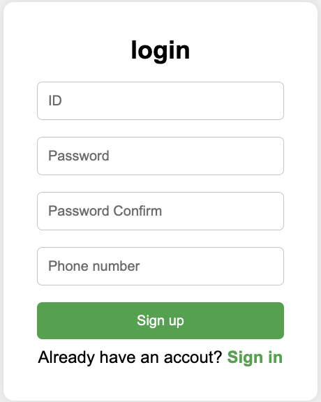

# ✨ LoginProject

> 간단하지만 확장 가능한 로그인 페이지를 만드는 개인프로젝트
> 기초적인 HTML/CSS부터 시작해서, 점차 JavaScript 기능을 추가하며 발전시켜 나갑니다 🚀

---

## 📸 Preview

---

## 🛠 사용 기술

- HTML5
- CSS3 (Flexbox, transition)
- Git & GitHub
- JavaScript (기능 추가 예정)

---

## ✅ 구현된 기능

 - [x]로그인 폼 / 회원가입 폼 UI 구현

 - [x]비밀번호 보기 👁️/🙈 토글 기능

 - [x]아이디 입력 시 영어+숫자 제한

 - [x]"ID 자동 저장" 체크박스 → localStorage 저장

 - [x]로그인 입력값 유효성 검사

 - [x]회원가입 입력값 유효성 검사

 - [x]비밀번호 확인 일치 검사

 - [x]중복 ID 체크

 - [x]localStorage에 회원정보 저장

 - [x]로그인 시 회원정보 검증

 - [x]로그인 / 회원가입 폼 전환 기능

---

## 📂 프로젝트 구조

LoginProject/
├── index.html         # 전체 UI 구성
├── style.css          # 스타일링 및 반응형
├── script.js          # 폼 전환, 유효성 검사, 저장 기능
└── README.md          # 프로젝트 설명서
