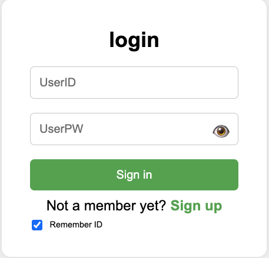

# ✨ LoginProject

> 간단하지만 확장 가능한 로그인 페이지를 만드는 개인프로젝트
> 기초적인 HTML/CSS부터 시작해서, 점차 JavaScript 기능을 추가하며 발전시켜 나갑니다 🚀

---

## 📸 Preview

---

## 🛠 사용 기술

- HTML5
- CSS3 (Flexbox, transition)
- Git & GitHub
- JavaScript (기능 추가 예정)

---

## ✅ 구현된 기능

- [x] 로그인 폼 UI
- [x] 버튼 호버 애니메이션

---

## 🛠 추가 예정 기능

- [ ] 비밀번호 눈 아이콘 (보이기/숨기기)
- [ ] 아이디 영어만 입력 제한
- [ ] 유효성 검사 (빈 값, 이메일 형식 등)
- [ ] 회원가입 폼 전환

---

## 📂 프로젝트 구조

LoginProject/ ├── index.html ├── style.css ├── README.md └── screenshot1.png
